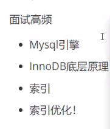

***`MyBatis`***

------


# MYBATIS


# 1.MyBatis简介


## 1.1 mybatis与hibernate

> ### 什么是 MyBatis ？
>
> ------
>
> MyBatis 是支持定制化[ SQL](https://www.w3cschool.cn/sql/)、存储过程以及高级映射的优秀的持久层框架。MyBatis 避免了几乎所有的 JDBC 代码和手动设置参数以及获取结果集。MyBatis 可以对配置和原生Map使用简单的 XML 或注解，将接口和 Java 的 POJOs(Plain Old Java Objects,普通的 Java对象)映射成数据库中的记录。


mybatis


## 1.2 MyBatis如何安装？

------

要使用 MyBatis， 只需将 mybatis-x.x.x.jar 文件置于 classpath 中即可。

如果使用 Maven 来构建项目，则需将下面的 dependency 代码置于 pom.xml 文件中：

```XML
  <dependency>
          <groupId>org.mybatis</groupId>
          <artifactId>mybatis</artifactId>
          <version>3.4.5</version>
  </dependency>
```


## 1.3 HELLOWORD

`接口式编程`

> 1.  确定返回的类型及参数类型
> 2.  为MyBatis的方法添加描述，做到见名知意


### 1.3.1 数据库的创建与构建实体

#### 1.3.1-1创建数据库表

> - 创建表，设置字段名
>
> 
>
> - 添加测试用数据
>
> 

#### 1.3.1-2构建实体类

Employee.java

```java
package com.geek.mybatis_01_hello.domain;

import lombok.Data;

/**
 * @Author user
 * @create 2020/11/18 14:03
 */

@Data
public class Employee {
    private Integer id;
    private String lastName;
    private String email;
    private String gender;
}
```

### 1.3.2 依赖添加与构建 SqlSessionFactory

#### 1.3.2-1 添加的依赖

pom.xml

```xml
<?xml version="1.0" encoding="UTF-8"?>
<project xmlns="http://maven.apache.org/POM/4.0.0" xmlns:xsi="http://www.w3.org/2001/XMLSchema-instance"
         xsi:schemaLocation="http://maven.apache.org/POM/4.0.0 https://maven.apache.org/xsd/maven-4.0.0.xsd">
    <modelVersion>4.0.0</modelVersion>
    <parent>
        <groupId>org.springframework.boot</groupId>
        <artifactId>spring-boot-starter-parent</artifactId>
        <version>2.4.0</version>
        <relativePath/> <!-- lookup parent from repository -->
    </parent>
    <groupId>com.geek</groupId>
    <artifactId>mybatis_01_hello</artifactId>
    <version>0.0.1-SNAPSHOT</version>
    <name>mybatis_01_hello</name>
    <description>Demo project for Spring Boot</description>

    <properties>
        <java.version>1.8</java.version>
    </properties>

    <dependencies>
        <dependency>
            <groupId>org.springframework.boot</groupId>
            <artifactId>spring-boot-starter-web</artifactId>
        </dependency>

        <dependency>
            <groupId>mysql</groupId>
            <artifactId>mysql-connector-java</artifactId>
            <version>8.0.22</version>
        </dependency>
        <!--lombok-->
        <dependency>
            <groupId>org.projectlombok</groupId>
            <artifactId>lombok</artifactId>
            <optional>true</optional>
        </dependency>
<!--        mybatis3-->
        <dependency>
            <groupId>org.mybatis</groupId>
            <artifactId>mybatis</artifactId>
            <version>3.4.5</version>
        </dependency>
        <dependency>
            <groupId>org.springframework.boot</groupId>
            <artifactId>spring-boot-starter-test</artifactId>
            <scope>test</scope>
        </dependency>
    </dependencies>

    <build>
        <resources>
            <resource>
                <directory>src/main/resources</directory>
                <includes>
                    <include>**/*.xml</include>
                </includes>
                <filtering>true</filtering>
            </resource>
        </resources>
        <plugins>
            <plugin>
                <groupId>org.springframework.boot</groupId>
                <artifactId>spring-boot-maven-plugin</artifactId>
            </plugin>
        </plugins>
    </build>

</project>
```


#### 1.3.2-2 从 XML 中构建 SqlSessionFactory

```java
String resource = "org/mybatis/example/mybatis-config.xml";
InputStream inputStream = Resources.getResourceAsStream(resource);
SqlSessionFactory sqlSessionFactory = new SqlSessionFactoryBuilder().build(inputStream);
```


XML 配置文件中包含了对 MyBatis 系统的核心设置，包括获取数据库连接实例的数据源（DataSource）以及决定事务作用域和控制方式的事务管理器（TransactionManager）。后面会再探讨 XML 配置文件的详细内容，这里先给出一个简单的示例：

mybatis-conf.xml

```xml
<?xml version="1.0" encoding="UTF-8" ?>
<!DOCTYPE configuration
        PUBLIC "-//mybatis.org//DTD Config 3.0//EN"
        "http://mybatis.org/dtd/mybatis-3-config.dtd">
<configuration>
    <environments default="development">
        <environment id="development">
            <transactionManager type="JDBC"/>
<!--            datasource 数据源-->
            <dataSource type="POOLED">
<!--                //driver mysql驱动-->
                <property name="driver" value="com.mysql.cj.jdbc.Driver"/>
                <!--             与数据库名称一致-->
                <property name="url" value="jdbc:mysql://localhost:3308/mybatis"/>
                <property name="username" value="root"/>
                <property name="password" value="123456"/>
            </dataSource>
        </environment>
    </environments>

<!--    将写好的sql映射配置文件注册到全局配置文件中-->
    <mappers>
        <mapper resource="EmployeeMapper.xml"/>
    </mappers>
</configuration>
```

### 1.3.3 构建Mapper数据库语句文件与绑定接口

​	EmployeeMapper.java

> 创建接口
>
> ```java
> public interface EmployeeMapper {
> 
>     public Employee getEmpById(Integer id);
> }//其返回值类型应与xml的数据库语句类型相同
> ```

> 构建mapper数据库语句文件 并绑定接口	EmployeeMapper.java
>
> EmployeeMapper.xml
>
> ```xml
> <?xml version="1.0" encoding="UTF-8" ?>
> <!DOCTYPE mapper
>         PUBLIC "-//mybatis.org//DTD Mapper 3.0//EN"
>         "http://mybatis.org/dtd/mybatis-3-mapper.dtd">
> <mapper namespace="com.geek.mybatis_01_hello.dao.EmployeeMapper">
> <!--
>     namespace： 名称空间 指定为接口的全类名
>     id:标签的唯一标识符
>     resultType：返回值类型
>     #{id}：从传过来的参数中取出id
> -->
>    <!-- 数据库语句      id：绑定其方法名 resultType：绑定实体类的路径--> 
>     <select id="getEmpById" resultType="com.geek.mybatis_01_hello.domain.Employee">
>         select id,last_name lastName,email,gender from mybatis_tb1 where id = #{id}
>     </select>
> </mapper>
> ```
>
> 
>
> **注意**：
>
> ```xml
> <mapper namespace="com.geek.mybatis_01_hello.dao.EmployeeMapper">
> ```
>
> ​	这里的那么namespcae 要与创建的接口`路径`相对应，否则会报找不到的错误


### 1.3.4 设计接口并调用

```java
@SpringBootTest
class Mybatis01HelloApplicationTests {

    /**
     * 1.根据xml配置文件（全局配置文件）创建一个SqlSessionFactory对象
     * 2.sql映射文件：配置每一个sql，及sql封装规则
     * 3.将sql映射文件注册总在全局配置文件中
     * 4.代码
     *  1）、根据全局配置文件得到SqlSessionFactory
     *  2)、使用SqlSessionFactory，获取SqlSession对象执行增删查改
     *      一个SqlSession就是与数据库的一次对话，完毕即close
     *  3)、使用sql唯一标识来告诉mybatis执行哪个sql。sql都保存在映射文件中
     * @throws IOException
     */
    
    //统一获取工厂方法
    public SqlSessionFactory getSqlSessionFactory() throws IOException {
        String resource = "mybatis-conf.xml";//根据全局配置文件 的路径
        InputStream inputStream = Resources.getResourceAsStream(resource);
        return new SqlSessionFactoryBuilder().build(inputStream);
    }
	//老版本
    void contextLoads() throws IOException {

        SqlSessionFactory sqlSessionFactory = getSqlSessionFactory();
        //2、获取SqlSession实例，能直接执行已经映射的sql语句
        SqlSession openSession = sqlSessionFactory.openSession();
        try {
            //传入唯一标识id 和一个参数
            Employee employee = openSession.selectOne("Employee.selectEmp",1 );
            System.out.println(employee);
        }finally {
            openSession.close();
        }

    }
    //新接口式编程
    @Test//测试 调用方法
    public void test01() throws IOException {
        //获取sqlSessionFactory对象
        SqlSessionFactory sqlSessionFactory = getSqlSessionFactory();

         //2.获取sqlSession对象
        SqlSession openSession = sqlSessionFactory.openSession();

        try {
            //3.获取接口的实现对象
            EmployeeMapper employeeMapper = openSession.getMapper(EmployeeMapper.class);
            //调用接口方法
            Employee employee = employeeMapper.getEmpById(1);
            //打印调用方法
            System.out.println(employeeMapper.getClass());
            System.out.println(employee);//打印结果
        }finally {
            //关闭会话
            openSession.close();
        }

    }

}
```

------

#### 测试

获得查询到的数据


### 1.3.5 总结

> 1. 接口式编程
>    - 原生  			Dao           ===>   DaoImpl
>    - myBatis        Mapper    ===>   xxxMapper.xml
> 2. SqlSession 代表与数据库的一次会话，因此用完需关闭
> 3. SqlSession与connection一样且都属于线程不安全，每次使用都应该获取一个新的对象
> 4. 自己编写的接口没有实现类，但myBatis会为该接口生成一个代理对象
>    - 生成的代理对象会将接口和xml文件信息进行绑定
>    - 代理对象写法：
>      - 接口名称  接口对象  =   SqlSession对象.getMapper(接口名称.class)
> 5. 配置文件
>    1. myBatis的全局配置文件
>
>       - 包含了数据库连接池信息，事务管理信息等....系统运行环境信息
>       - 该文件可以不需要，可以通过代码实现
>
>    2. sql映射文件
>
>       - 保持了每一个sql语句的映射信息
>       - 实现将sql抽离，由程序员来编写
>       - 该文件必须存在，无法通过代码实现
>

# 2.全局配置文件

## 2.1 配置configuration标签

### 2.1.1 属性（properties）

这些属性可以在外部进行配置，并可以进行动态替换。你既可以在典型的 Java 属性文件中配置这些属性，也可以在 properties 元素的子元素中设置。例如：

```
<properties resource="org/mybatis/example/config.properties">
  <property name="username" value="dev_user"/>
  <property name="password" value="F2Fa3!33TYyg"/>
</properties>
```

设置好的属性可以在整个配置文件中用来替换需要动态配置的属性值。比如:

```xml
<dataSource type="POOLED">
  <property name="driver" value="${driver}"/>
  <property name="url" value="${url}"/>
  <property name="username" value="${username}"/>
  <property name="password" value="${password}"/>
</dataSource>
```

### 2.1.2 设置（settings）

这是 MyBatis 中极为重要的调整设置，它们会改变 MyBatis 的运行时行为。 下表描述了设置中各项设置的含义、默认值等。

> setting：
>
> - setting: 用于设置每一个重要的设置项
> - name: 设置项名
> - value: 设置取值项

| **设置名**               | **描述**                                                     | **有效值**  | **默认值** |
| ------------------------ | ------------------------------------------------------------ | ----------- | ---------- |
| mapUnderscoreToCamelCase | 是否开启驼峰命名自动映射，即从经典数据库列名 A_COLUMN 映射到经典 Java 属性名 aColumn。 | true\|false | False      |
|                          |                                                              |             |            |

示例：

开启驼峰 约束

```xml
<settings>
    <setting name="mapUnderscoreToCamelCase" value="true"/>
</settings>
```


一个配置完整的 settings 元素的示例如下：

```xml
<settings>
  <setting name="cacheEnabled" value="true"/>
  <setting name="lazyLoadingEnabled" value="true"/>
  <setting name="multipleResultSetsEnabled" value="true"/>
  <setting name="useColumnLabel" value="true"/>
  <setting name="useGeneratedKeys" value="false"/>
  <setting name="autoMappingBehavior" value="PARTIAL"/>
  <setting name="autoMappingUnknownColumnBehavior" value="WARNING"/>
  <setting name="defaultExecutorType" value="SIMPLE"/>
  <setting name="defaultStatementTimeout" value="25"/>
  <setting name="defaultFetchSize" value="100"/>
  <setting name="safeRowBoundsEnabled" value="false"/>
  <setting name="mapUnderscoreToCamelCase" value="false"/>
  <setting name="localCacheScope" value="SESSION"/>
  <setting name="jdbcTypeForNull" value="OTHER"/>
  <setting name="lazyLoadTriggerMethods" value="equals,clone,hashCode,toString"/>
</settings>
```


### 2.1.3 类型别名（typeAliases）

型别名可为 Java 类型设置一个缩写名字。 它仅用于 XML 配置，意在降低冗余的全限定类名书写。例如：

```xml
<typeAliases>
  <typeAlias alias="Author" type="domain.blog.Author"/>
  <typeAlias alias="Blog" type="domain.blog.Blog"/>
  <typeAlias alias="Comment" type="domain.blog.Comment"/>
  <typeAlias alias="Post" type="domain.blog.Post"/>
  <typeAlias alias="Section" type="domain.blog.Section"/>
  <typeAlias alias="Tag" type="domain.blog.Tag"/>
</typeAliases>
```

> **选项值**：
>
> ```xml
>   <typeAlias alias="Author" type="domain.blog.Author"/>
> ```
>
> type:指定要起别名的类型全类名默认别名式类名小写
>
> alias：指定其新的别名
>
> 
>
> **注意**：
>
> ​	`别名`不区分大小写


- #### 批量取别名 package

> package：为某个包下所有类批量起别名
>
> - name：指定包名（为当前以及下面所有后代包的每一个类都起一个默认别名（类名小写））


- #### 使用注解起别名

> @Alias注解 来为某个类型起别名
>
> 


#### 保留别名

MyBatis 保留别名

[mybatis-3文档]: https://mybatis.org/mybatis-3/zh/configuration.html

下面是一些为常见的 Java 类型内建的类型别名。它们都是不区分大小写的，注意，为了应对原始类型的命名重复，采取了特殊的命名风格

| 别名       | 映射的类型 |
| :--------- | :--------- |
| _byte      | byte       |
| _long      | long       |
| _short     | short      |
| _int       | int        |
| _integer   | int        |
| _double    | double     |
| _float     | float      |
| _boolean   | boolean    |
| string     | String     |
| byte       | Byte       |
| long       | Long       |
| short      | Short      |
| int        | Integer    |
| integer    | Integer    |
| double     | Double     |
| float      | Float      |
| boolean    | Boolean    |
| date       | Date       |
| decimal    | BigDecimal |
| bigdecimal | BigDecimal |
| object     | Object     |
| map        | Map        |
| hashmap    | HashMap    |
| list       | List       |
| arraylist  | ArrayList  |
| collection | Collection |
| iterator   | Iterator   |


### 2.1.4 类型处理器（typeHandlers）

MyBatis 在设置预处理语句（PreparedStatement）中的参数或从结果集中取出一个值时， 都会用类型处理器将获取到的值以合适的方式转换成 Java 类型。下表描述了一些默认的类型处理器。

**`提示`** 从 3.4.5 开始，MyBatis 默认支持 JSR-310（日期和时间 API） 。

| 类型处理器              | Java 类型                      | JDBC 类型                            |
| :---------------------- | :----------------------------- | :----------------------------------- |
| `BooleanTypeHandler`    | `java.lang.Boolean`, `boolean` | 数据库兼容的 `BOOLEAN`               |
| `ByteTypeHandler`       | `java.lang.Byte`, `byte`       | 数据库兼容的 `NUMERIC` 或 `BYTE`     |
| `ShortTypeHandler`      | `java.lang.Short`, `short`     | 数据库兼容的 `NUMERIC` 或 `SMALLINT` |
| `IntegerTypeHandler`    | `java.lang.Integer`, `int`     | 数据库兼容的 `NUMERIC` 或 `INTEGER`  |
| `LongTypeHandler`       | `java.lang.Long`, `long`       | 数据库兼容的 `NUMERIC` 或 `BIGINT`   |
| `FloatTypeHandler`      | `java.lang.Float`, `float`     | 数据库兼容的 `NUMERIC` 或 `FLOAT`    |
| `DoubleTypeHandler`     | `java.lang.Double`, `double`   | 数据库兼容的 `NUMERIC` 或 `DOUBLE`   |
| `BigDecimalTypeHandler` | `java.math.BigDecimal`         | 数据库兼容的 `NUMERIC` 或 `DECIMAL`  |
| ....                    | ....                           | ....                                 |

[mybatis-3文档]: https://mybatis.org/mybatis-3/zh/configuration.html	"配置类型"


### 2.1.5 插件（plugins）

MyBatis 允许你在映射语句执行过程中的某一点进行拦截调用。默认情况下，MyBatis 允许使用插件来拦截的方法调用包括：

- Executor (update, query, flushStatements, commit, rollback, getTransaction, close, isClosed)
- ParameterHandler (getParameterObject, setParameters)
- ResultSetHandler (handleResultSets, handleOutputParameters)
- StatementHandler (prepare, parameterize, batch, update, query)

这些类中方法的细节可以通过查看每个方法的签名来发现，或者直接查看 MyBatis 发行包中的源代码。 如果你想做的不仅仅是监控方法的调用，那么你最好相当了解要重写的方法的行为。 因为在试图修改或重写已有方法的行为时，很可能会破坏 MyBatis 的核心模块。 这些都是更底层的类和方法，所以使用插件的时候要特别当心。


### 2.1.6 环境配置（environments）

MyBatis 可以配置成适应多种环境，这种机制有助于将 SQL 映射应用于多种数据库之中， 现实情况下有多种理由需要这么做。例如，开发、测试和生产环境需要有不同的配置；或者想在具有相同 Schema 的多个生产数据库中使用相同的 SQL 映射。还有许多类似的使用场景。

**不过要记住：尽管可以配置多个环境，但每个 SqlSessionFactory 实例只能选择一种环境。**

环境配置，mybatis可以配置多种环境，default用于指定使用哪种环境，可达到快速切换

**`标签`：**

- environment 配置具体的环境信息，id是该环境的唯一标识供default默认快速切换

- transactionManager 事务管理器  type 事务管理器类型

> type 事物管理器类型，有两个参数选择
>
> 在 MyBatis 中有两种类型的事务管理器（也就是 type="**[JDBC|MANAGED]**"）：
>
> - JDBC  (JdbcTransactionFactory) 
>
>
> 直接使用了 JDBC 的提交和回滚设施，它依赖从数据源获得的连接来管理事务作用域
>
> - MANAGED ( ManagedTransactionFactory) 
>
>
> 让容器来管理事务的整个生命周期（比如 JEE 应用服务器的上下文）。 默认情况下它会关闭连接。然而一些容器并不希望连接被关闭，因此需要将 closeConnection 属性设置为 false 来阻止默认的关闭行为

- dataSource 数据源

> dataSource 元素使用标准的 JDBC 数据源接口来配置 JDBC 连接对象的资源。
>
> 大多数 MyBatis 应用程序会按示例中的例子来配置数据源。虽然数据源配置是可选的，但如果要启用延迟加载特性，就必须配置数据源。
>
> 有三种内建的数据源类型（也就是 type="**[UNPOOLED|POOLED|JNDI]**"）：
>
> type= 三种数据源类型
>
> - UNPOOLED (UnpooledDataSourceFactory )
>   - 数据源的实现会每次请求时打开和关闭连接
> - POOLED(PooledDataSourceFactory)
>   - 数据源的实现利用“池”的概念将 JDBC 连接对象组织起来，避免了创建新的连接实例时所必需的初始化和认证时间
> - JNDI (JndiDataSourceFactory)
>   - 数据源实现是为了能在如 EJB 或应用服务器这类容器中使用，容器可以集中或在外部配置数据源，然后放置一个 JNDI 上下文的数据源引用
>
> 自定义数据源：
>
> ​	通过实现DataSourceFactory接口 type指定为全类名
>
> 

### 2.1.7 数据库厂商标识（databaseIdProvider）

​	MyBatis 可以根据不同的数据库厂商执行不同的语句，这种多厂商的支持是基于映射语句中的 `databaseId` 属性。 MyBatis 会加载带有匹配当前数据库 `databaseId` 属性和所有不带 `databaseId` 属性的语句。 如果同时找到带有 `databaseId` 和不带 `databaseId` 的相同语句，则后者会被舍弃。 为支持多厂商特性，只要像下面这样在 mybatis-config.xml 文件中加入 `databaseIdProvider` 即可：

```xml
<databaseIdProvider type="DB_VENDOR" />
```

type = “DB_VENDOR”  (VendorDatabaseIdProvider)

​	获取数据库厂商的标识(驱动 getDatabaseProductName)，mybatis会根据标识执行对应sql语句

```xml
<databaseIdProvider type="DB_VENDOR">
	<property name="Mysql" value="mysql"/>
    <property name="SQL Server" value="sqlserver"/>
</databaseIdProvider>
```

--

**在select标签中使用databaseId来确定使用的厂商**

```xml
<select id="getEmpById" resultType="com.geek.mybatis_01_hello.domain.Employee"databaseId="mysql">
    
    select id,last_name lastName,email,gender from mybatis_tb1 where id = #{id}
</select>
```


### 2.1.8 映射器（mappers）

> 注册sql映射
>
> - resource 引用类路径下的sql映射文件
>
> ```xml
> <!-- 使用相对于类路径的资源引用 -->
> <mappers>
>   <mapper resource="org/mybatis/builder/AuthorMapper.xml"/>
> </mappers>
> ```
>
> - url 引用磁盘或网络路径下的sql映射文件
>
> ```xml
> <!-- 使用完全限定资源定位符（URL） -->
> <mappers>
>   <mapper url="file:///var/mappers/AuthorMapper.xml"/>
> </mappers>
> ```
>
> - class 引用(注册)接口
>
> - 有sql映射文件，且映射文件与接口同名，并放在与接口同一目录下
> - 没有sql映射文件，所有的sql都是利用注解写在接口上的，使用注解@Select
>
> 推荐：
>
> ​	重要Dao接口使用sql映射文件
>
> ​	不重要的Dao接口使用注解


**批量注册：**

```xml
<!-- 将包内的映射器接口实现全部注册为映射器 -->
<mappers>
  <package name="org.mybatis.builder"/>
</mappers>
```

configuration标签编辑顺序


**@Select的使用**：

```java
public interface MyBatisInterface {

	@Select("sql语句")
	@Select(" select * from tbl_employee where id = #{id}")
 public 返回类型 方法名称(参数类型 参数名称);

}
```


## 2.2 配置解析

### 1.核心配置文件 mybatis-config.xml

MyBatis 的配置文件包含了会深深影响 MyBatis 行为的设置和属性信息。 配置文档的顶层结构如下：

- configuration（配置）
  - [properties（属性）](https://mybatis.org/mybatis-3/zh/configuration.html#properties)
  - [settings（设置）](https://mybatis.org/mybatis-3/zh/configuration.html#settings)
  - [typeAliases（类型别名）](https://mybatis.org/mybatis-3/zh/configuration.html#typeAliases)
  - [typeHandlers（类型处理器）](https://mybatis.org/mybatis-3/zh/configuration.html#typeHandlers)
  - [objectFactory（对象工厂）](https://mybatis.org/mybatis-3/zh/configuration.html#objectFactory)
  - [plugins（插件）](https://mybatis.org/mybatis-3/zh/configuration.html#plugins)
  - environments（环境配置）
    - environment（环境变量）
      - transactionManager（事务管理器）
      - dataSource（数据源）
  - [databaseIdProvider（数据库厂商标识）](https://mybatis.org/mybatis-3/zh/configuration.html#databaseIdProvider)
  - [mappers（映射器）](https://mybatis.org/mybatis-3/zh/configuration.html#mappers)

### 2. 环境配置（environments）

environment（环境变量）

- transactionManager（事务管理器）
- dataSource（数据源）

mybatis 默认事务管理器 是jdbc  连接池：POOLED

### 3.属性（properties）

这些属性可以在外部进行配置，并可以进行动态替换。你既可以在典型的 Java 属性文件中配置这些属性，也可以在 properties 元素的子元素中设置

编写配置文件

database.properties

```properties
url=jdbc:mysql://localhost:3306/mybatisdb?serverTimezone=UTC
driver=com.mysql.cj.jdbc.Driver
```

然后在配置文件中 引入

```xml
<properties resource="database.properties">
    <property name="username" value="root"/>
    <property name="password" value="123456"/>
</properties>
```

可以在**`properties`**标签中 增加键值对形式的 属性

- 如果两个文件使用同一个字段，则优先使用外部文件字段

### 4.类型别名（typeAliases）

​	类型别名可为 Java 类型设置一个缩写名字。 它仅用于 XML 配置，意在降低冗余的全限定类名书写。例如：

```xml
<!--    为实体类起别名-->
    <typeAliases>
        <typeAlias type="com.geek.model.User" alias="User"></typeAlias>
    </typeAliases>
```

​	也可以指定一个包名，MyBatis 会在包名下面搜索需要的 Java Bean，比如：

```xml
<!--        为整个包起别名 其每个类别名默认为名首字母小写-->
        <package name="com.geek.model" />
```

扫描实体类的包，别名为默认该类 类名 的首字母小写


- **若有注解，则别名为其注解值**

```java
@Alias("author")
public class Author {
    ...
}
```


### 5.设置（settings）

这是 MyBatis 中极为重要的调整设置，它们会改变 MyBatis 的运行时行为

| 设置名                   | 描述                                                         | 有效值        | 默认值 |
| :----------------------- | :----------------------------------------------------------- | :------------ | :----- |
| cacheEnabled             | 全局性地开启或关闭所有映射器配置文件中已配置的任何缓存。     | true \| false | true   |
| lazyLoadingEnabled       | 延迟加载的全局开关。当开启时，所有关联对象都会延迟加载。 特定关联关系中可通过设置 `fetchType` 属性来覆盖该项的开关状态。 | true \| false | false  |
| mapUnderscoreToCamelCase | 是否开启驼峰命名自动映射，即从经典数据库列名 A_COLUMN 映射到经典 Java 属性名 aColumn。 | true \| false | False  |

### 6.其他配置

- plugins
  - mybatis-generator-core
  - mybatis-puls     （简化）
  - 通用mapper

### 7.映射器（mappers）

MapperRegistry：注册绑定我们的Mapper文件

方式一：resource

```xml
<!--    每一个Mapper。xml 都需要在mybatis 核心的配置文件中注册-->
    <mappers>
        <mapper resource="com/geek/dao/UserMapper.xml"/>
    </mappers>
```

方式二：使用class 来绑定

```xml
<mapper class="com.geek.dao.UserMapper"/>
```

`注意`：

- 接口和其Mapper配制文件必须同名
- 接口和其Mapper配制文件必须在同一个包下

方式三：使用扫描包进行注入绑定


### 8. 生命周期与作用域

**SqlSessionFactoryBuilder**

- 这个类可以被实例化、使用和丢弃，一旦创建了 SqlSessionFactory，就不再需要它了。

- 局部变量

**SqlSessionFactory**

- 说白了就是可想象为：数据库连接池
- SqlSessionFactory 一旦被创建就应该在应用的运行期间一直存在，**没有任何理由丢弃它或重新创建另一个实例**
- 因此 SqlSessionFactory 的最佳作用域是应用作用域
- 最简单的就是使用**单例模式**或者静态单例模式。

**SqlSession**

- 连接到连接池的请求

- SqlSession 的实例不是线程安全的，因此是不能被共享的，所以它的最佳的作用域是请求或方法作用域。

- 用完需要关闭，否则会占用资源

# 3.Mybatis映射文件


## 3.1 增删查改测试

### 3.1.1 接口编写

```java
package com.geek.mybatis_01_hello.dao;

import com.geek.mybatis_01_hello.domain.Employee;

/**
 * @Author user
 * @create 2020/11/18 16:15
 */
public interface EmployeeMapper {

    public Employee getEmpById(Integer id);

    public void addEmp(Employee employee);

    public void updateEmp(Employee employee);

    public void deleteEmp(Integer id);
}
```

### 3.1.2 映射的sql 映射文件

```xml
<?xml version="1.0" encoding="UTF-8" ?>
<!DOCTYPE mapper
        PUBLIC "-//mybatis.org//DTD Mapper 3.0//EN"
        "http://mybatis.org/dtd/mybatis-3-mapper.dtd">
<mapper namespace="com.geek.mybatis_01_hello.dao.EmployeeMapper">
<!--
    namespace： 名称空间 指定为接口的全类名
    id:标签的唯一标识符
    resultType：返回值类型
    #{id}：从传过来的参数中取出id
-->
    <select id="getEmpById" resultType="com.geek.mybatis_01_hello.domain.Employee">
        select id,last_name lastName,email,gender from mybatis_tb1 where id = #{id}
    </select>

        <insert id="addEmp" parameterType="com.geek.mybatis_01_hello.domain.Employee">
            insert into mybatis_tb1(last_name,email,gender)
            values(#{lastName},#{email},#{gender})
        </insert>

    <update id="updateEmp" parameterType="com.geek.mybatis_01_hello.domain.Employee">
        update mybatis_tb1
            set last_name=#{lastName},email=#{email},gender=#{gender}
            where id=#{id}
    </update>
</mapper>
```

### 3.1.3 增删查改


- 增加

```xml
<!--            public void addEmp(Employee employee)-->
<!--            parameterType :参数类型  可省略-->
<!--            获取自增主键的值：
                        mysql支持自增主键， 自增主键值得获取，mybatis 是利用statement.getGeneratedKey();
                        userGeneratedKeys="true"; 使用自增主键获取主键值策略
                        keyProperty：指定对应的主键属性，也就是mybatis 获取到主键值后，将这个值封装给javaBean的那个值
-->
        <insert id="addEmp" parameterType="com.geek.mybatis_01_hello.domain.Employee">
            insert into mybatis_tb1(last_name,email,gender)
            values(#{lastName},#{email},#{gender})
        </insert>
```

- 修改

```xml
<update id="updateEmp" parameterType="com.geek.mybatis_01_hello.domain.Employee">
    update mybatis_tb1
        set last_name=#{lastName},email=#{email},gender=#{gender}
        where id=#{id}
</update>
```


- 查询

```xml
<select id="getEmpById" resultType="com.geek.mybatis_01_hello.domain.Employee">
    select id,last_name lastName,email,gender from mybatis_tb1 where id = #{id}
</select>
```


- 删除

```xml
<delete id="deleteEmp" parameterType="com.geek.mybatis_01_hello.domain.Employee">
    delete FROM mybatis_tb1 WHERE id=#{id};
</delete>
```

## 3.2 多数据传输 复合查询

### 3.2.1@Param

> - Employee getEmpByIdAndLastName //多个参数下的 mybatis 传值
>   --命名参数； 明确指定封装参数时的map的key ； @Param("id")
>         多个参数会被封装为一个map
>         key：使用@Param注解指定的值
>         value:参数值
>     #{指定的key} 来取出对应的参数值

**实例接口**

```java
Employee getEmpByIdAndLastName(@Param("id")Integer id, @Param("lastName")String lastName);
```

映射的sql

```xml
<!--    多个值根据指定的命名参数 来填写value-->
    <select id="getEmpByIdAndLastName" resultType="com.geek.mybatis_01_hello.domain.Employee">
        select * from mybatis_tb1 where id =#{id} and last_name=#{lastName}

    </select>
```

### 3.2.2Map

```
Map:
    如果多个参数不是业务模型中的数据，没有对应的pojo，为了方便，我们也可以传入map
    #{key}；取出map中对应的值
```

**接口**

```java
Employee getEmpByMap(Map<String, Object> map);
```

sql

```xml
<select id="getEmpByMap" resultType="com.geek.mybatis_01_hello.domain.Employee">
    select * from mybatis_tb1 where id =#{id} and last_name=#{lastName}
</select>
```

方法

```java
//通过map来传输数据
Map<String, Object> map = new HashMap<>();
map.put("id",2);
map.put("lastName","linns");
Employee employee = mapper.getEmpByMap(map);

System.out.println(employee);
```

### 3.3.3 其他方式


- pojo：
      如果多个参数正好是业务逻辑的数据模型，我们可以直接传入pojo
          #{属性名}；取出传入的pojo属性值

- TO：
      如果多个参数不是业务模型中的数据，但是经常要用，推荐编写一个TO（Transfer Object）数据传输对象
      page{
          int xxxx；
          int xxx;

  ​	}

### 3.3.4注意事项

`mybatis`开启驼峰命名法：

> mybtais-conf 文件 
>
> config
>
> settings下
>
> ```XML
> <setting name="mapUnderscoreToCamelCase" value="true"/>
> ```
>
> 开启驼峰命名
>
> - 如果不开启则会导致数据字段与数据库 无法对应 数据返回null 值

## 3.3 mybatis模糊查询

```xml
<select id="getUserList" resultType="">
select * from mybatis01.user where name like "%"#{value}"%" 
</select>
```


- 在sql 语句中拼接使用通配符 % % 来进行模糊查询

方法接口

```java
List<User> userList = mapper.getUserLike("Re")
```


## 3.4 解决属性名 与 字段名不一致的问题


解决方法

- 起别名

```xml
<select id="getUserById" resultType="">
    select id,name,pwd as password from mybatis_tb1 where id="#{id}"
</select>
```

### 

### resultMap

结果集映射

```xml
<!--    结果集映射-->
    <resultMap id="EmpMap" type="Employee">
<!--        column 数据库中的字段，property实体类中的属性-->
        <result column="id" property="id"></result>
        <result column="name" property="name"></result>
        <result column="pwd" property="password"></result>
    </resultMap>
    <select id="getEmpById" resultMap="EmpMap">
        select * from mybatis_tb1 where id=#{id}
    </select>
```


- `resultMap` 元素是 MyBatis 中最重要最强大的元素
- ResultMap 的设计思想是，对简单的语句做到零配置，对于复杂一点的语句，只需要描述语句之间的关系就行了。

 

```xml
<!--    结果集映射 id  type 为实体类名-->
<!--        column 数据库中的字段，property实体类中的属性名-->
    <resultMap id="EmpMap" type="Employee">
        <result column="pwd" property="password"></result>
    </resultMap>
```

  


# 4. 日志

## 4.1 日志工厂

如果数据库操作，出现了异常，则需要排错，日志是最好的助手

日志工厂

| 设置名  | 描述                                                  | 有效值                                                       | 默认值 |
| ------- | ----------------------------------------------------- | ------------------------------------------------------------ | ------ |
| logImpl | 指定 MyBatis 所用日志的具体实现，未指定时将自动查找。 | SLF4J \| LOG4J \| LOG4J2 \| JDK_LOGGING \| COMMONS_LOGGING \| STDOUT_LOGGING \| NO_LOGGING | 未设置 |

- SLF4J
- LOG4J
-  LOG4J2 
- JDK_LOGGING
- COMMONS_LOGGING
-  STDOUT_LOGGING
-  NO_LOGGING

在MyBatis 中设置具体哪一个日志实现

**STDOUT_LOGGING**实现标准输出

在MyBatis核心配置文件中， 配置日志

```xml
<setting name="logImpl" value="STDOUT_LOGGING"/>
```


## 4.2LOG4J

**log4j**

Log4j是[Apache](https://baike.baidu.com/item/Apache/8512995)的一个开源项目，通过使用Log4j，我们可以控制日志信息输送的目的地是[控制台](https://baike.baidu.com/item/控制台/2438626)、文件、[GUI](https://baike.baidu.com/item/GUI)组件，甚至

1. 导包

```xml
<dependency>
    <groupId>log4j</groupId>
    <artifactId>log4j</artifactId>
    <version>1.2.17</version>
</dependency>
```

2. log4j 配置文件

```properties
log4j.rootLogger=DEBUG,console,file

### 配置输出到控制台 ###
log4j.appender.console = org.apache.log4j.ConsoleAppender
log4j.appender.console.Target = System.out
log4j.appender.console.layout = org.apache.log4j.PatternLayout
log4j.appender.console.layout.ConversionPattern =  %d{ABSOL


### 配置输出到文件 ###
log4j.appender.fileAppender = org.apache.log4j.FileAppender
log4j.appender.fileAppender.File = logs/MyBatis04.log
log4j.appender.fileAppender.Append = true
log4j.appender.fileAppender.Threshold = DEBUG
log4j.appender.fileAppender.layout = org.apache.log4j.PatternLayout
log4j.appender.fileAppender.layout.ConversionPattern = %-d{yyyy-MM-dd HH:mm:ss}  [ %t:%r ] - [ %p ]  %m%n

### 设置输出sql的级别，其中logger后面的内容全部为jar包中所包含的包名 ###
log4j.logger.org.apache=DEBUG
log4j.logger.java.sql.Connection=DEBUG
log4j.logger.java.sql.Statement=DEBUG
log4j.logger.java.sql.PreparedStatement=DEBUG
log4j.logger.java.sql.ResultSet=DEBUG
```

3. 配置log4j为日志的实现

```xml
    <settings>
        <setting name="logImpl" value="LOG4J"/>
    </settings>
```

4. Log4j 的使用


**简单使用**

	1. 在 要使用log4j的类中导入包，
 	2. 日志对象 ，参数为当前类的class

```java
static Logger logger = Logger.getLogger(Mybatis04ApplicationTests.class);
```

3. 日志级别

```java
logger.info("info:进入log4j");
logger.debug("debug:进入log4j");
logger.error("error:进入log4j");
```


# 5.MyBatis 分页

## 1.使用Limit 分页

语法：

```
Select * from user limit startIndex,pageSize
```


myBatis 实现分页

1. 接口

```java
//分页
List<User> getUserByLimit(Map<String,Integer> map);
```

2. Mapper。xml

```xml
<!--    分页查询-->
    <select id="getUserByLimit" parameterType="map" resultMap="UserMap">
        select * from mybatis_tb1 limit #{startIndex},#{pageSize};
    </select>
```

3. Test

```java
@Test
public void getUserByLimit(){
    SqlSession sqlSession = MyBatisUtils.getSqlSession();
    UserMapper mapper = sqlSession.getMapper(UserMapper.class);

    HashMap<String, Integer> map = new HashMap<>();
    map.put("startIndex",1);
    map.put("pageSize",2);

    List<User> userList= mapper.getUserByLimit(map);
    for (User user : userList) {
        System.out.println(user);
    }

}
```


**mybatis 分页插件**

PageHelper


# 6.mybatis 注解开发

## 6.1.使用注解开发

1. 注解在接口上实现

```java
@Select("select * from mybatis_tb1")
List<User> getUsers();
```

2. 需要在核心配置文件中绑定接口

```xml
    <mappers>
<!--        绑定接口-->
        <mapper class="com.geek.dao.UserMapper"/>
    </mappers>
```

3. 测试

本质：反射机制实现

底层：动态代理


## 6.2 注解 crud

我们可以在工具类创建的时候实现自动提交事务

```java
public static SqlSession getSqlSession(){
    return sqlSessionFactory.openSession(true);
}
```


编写接口，增加注解

```java
@Select("select * from mybatis_tb1")
List<User> getUsers();

@Insert("insert into mybatis_tb1(id,last_name,password,gender,email) values (#{id},#{lastName},#{password},#{gender},#{email})")
int addUser(User user);

@Update("update mybatis_tb1 set last_name=#{lastName},password=#{password} where id=#{id}")
int updateUser(User user);

@Delete("delete from mybatis_tb1 where id = #{id}")
int deleteUser(@Param("id") int id);
```


编写测试类

```java
    @Test
    public void getUsers(){
        SqlSession sqlSession = MyBatisUtils.getSqlSession();
        UserMapper mapper = sqlSession.getMapper(UserMapper.class);
        mapper.getUsers();
        mapper.addUser(new User(4, "1", "123213","123","1234"));
        mapper.updateUser(new User(2, "3", "222", "111", "1234566"));
        mapper.deleteUser(4);

        sqlSession.close();
    }
```

**必须在配置文件中先注册**

```xml
    <mappers>
<!--        绑定接口-->
        <mapper class="com.geek.dao.UserMapper"/>
    </mappers>
```


关于@Param("")

- 基本类型的参数或者String类型 需要加上
- 引用类型不需要加
- 如果只有一个基本类型，可以忽略，建议加上
- 在SQL中引用的就是我们这里的@Param中设定的属性名


#{}   ${} 区别


# 7.mybatis 多对一,一对多处理

## 多对一处理

### 按照查询嵌套处理


```xml
<select id="getStudent" resultMap="StudentTeacher">
    select * from student
</select>
<resultMap id="StudentTeacher" type="Student">
    <association property="teacher" column="tid" javaType="Teacher" select="getTeacher"></association>
</resultMap>
<select id="getTeacher" resultType="Teacher">
    select * from teacher where id=#{id};
</select>
```

- 子查询
- 查询student 将返回的resultMap 指定为StudentTeacher
- 使用association 指定property属性 为teacher  对应的列名为tid 类型 为Teacher类 select指定查询教师的sql


### 按照结果嵌套查询

```xml
<select id="getStudent2" resultMap="StudentTeacher2 ">
    select s.id sid,s.name sname,t.name tname from student s,teacher t where s.tid=t.id
</select>
<resultMap id="StudentTeacher2" type="Student">
    <result property="id" column="sid"></result>
    <result property="name" column="sname"></result>
    <association property="teacher" javaType="Teacher">
        <result property="name" column="tname"></result>
    </association>
</resultMap>
```

Mysql多对一查询方式

- 子查询
- 联表查询


## 一对多处理

1.搭建环境

**实体类**

```java
@Data
public class Student {

    private int id;
    private String name;
    private int tid;

//    关联teacher
    private Teacher teacher;
}
```

```java
@Data
public class Teacher {
    private int id;
    private String name;

//    关联学生集合
    private List<Student> students;
}
```


### 按照结果嵌套处理

```xml
 <select id="getTeacher" resultMap="TeacherStudent">
        select s.id sid,s.name sname, t.name tname,t.id tid
        from student s,teacher t
        WHERE s.tid = t.id and t.id=#{tid}
    </select>
    <resultMap id="TeacherStudent" type="Teacher">
        <result property="id" column="tid"/>
        <result property="name" column="tname"/>
        <!--        复杂的属性，需要单独处理 对象 ：association    集合：collection
         javaType="" 指定的属性类型
         -->
        <collection property="students" ofType="Student">
            <result property="id" column="sid"/>
            <result property="name" column="sname"/>
            <result property="tid" column="tid"/>
        </collection>
<!--        集合中的泛型信息使用 ofType获取-->
    </resultMap>
```

### 按照查询嵌套处理

```xml
<!--    -->
    <select id="getTeacher2" resultMap="TeacherStudent2">
            select * from teacher where id=#{tid}
    </select>
    <resultMap id="TeacherStudent2" type="Teacher">
        <collection property="students" javaType="ArrayList" ofType="Student" select="getStudentByTeacherId" column="id">

        </collection>
    </resultMap>
    <select id="getStudentByTeacherId" resultType="Student">
        select * from student where tid=#{tid}
    </select>
```


--

- 关联 - association 【多对一】
- 集合 - collection  【一对多】
- javaType & ofType

javaType 用来指定实体类中属性的类型

ofType 用来指定映射到List 或者集合的pojo类型， 泛型 中的约束类型


tips：

- 保证sql可读性
- 注意一对多，多对一 字段名，属性名 问题


# 8. mybatis 动态sql 

动态sql ：根据不同的条件生产不同的sql 语句

动态 SQL 是 MyBatis 的强大特性之一。如果你使用过 JDBC 或其它类似的框架，你应该能理解根据不同条件拼接 SQL 语句有多痛苦，例如拼接时要确保不能忘记添加必要的空格，还要注意去掉列表最后一个列名的逗号。利用动态 SQL，可以彻底摆脱这种痛苦。


- if
- choose (when, otherwise)
- trim (where, set)
- foreach




## 环境搭建

编写实体类

```java
@Data
public class Blog {
    private String id;
    private String title;
    private String author;
    private Date createTime;
    private int views;

}
```


## IF

```xml
<select id="selectBlogIF" parameterType="map" resultType="blog">
    select * from blog where 1=1
    <if test="title!=null">
        and title =#{title}
    </if>
    <if test="author!=null">
        and title =#{author}
    </if>
</select>
```


## choose (when, otherwise)

有时候，我们不想使用所有的条件，而只是想从多个条件中选择一个使用。针对这种情况，MyBatis 提供了 choose 元素，它有点像 Java 中的 switch 语句。

```xml
<select id="selectBlogChoose" parameterType="map" resultType="blog">
    select * from blog
    <where>
        <choose>
            <when test="title!=null">
                title =#{title}
            </when>
            <when test="author != null">
                 and author=#{author}
            </when>
            <otherwise>
                and views =#{views}
            </otherwise>
        </choose>
    </where>
</select>
```

- 当满足一个条件时 ，sql不会再继续往下执行
- otherwise 当所有条件 均不满足时 执行
- 当条件都满足时只会执行 满足的第一个


*where* 元素只会在子元素返回任何内容的情况下才插入 “WHERE” 子句。而且，若子句的开头为 “AND” 或 “OR”，*where* 元素也会将它们去除。

## trim (where, set)

```xml
<select id="selectBlogWhere" parameterType="map" resultType="blog">
    select * from blog
    <where>
        <if test="title!=null">
             title =#{title}
        </if>
        <if test="author!=null">
            and author =#{author}
        </if>
    </where>
</select>
```

```xml
<update id="updateBlog" parameterType="map">
    update blog
    <set>
        <if test="title != null">
            title = #{title},
        </if>
        <if test="author != null">
            author = #{author}
        </if>
    </set>
    where id=#{id}
</update>
```


**tips**：

mybatis 自动提交事务管理

```java
public static SqlSession getSqlSession(){
    return sqlSessionFactory.openSession(true);
}
```

**在openSession() 的括号里写true, 设定自动提交事务,**


## SQL片段

- 使用SQL标签抽取公共部分 id设置

```xml
<sql id="if-title-author">
    <if test="title!=null">
        and title =#{title}
    </if>
    <if test="author!=null">
        and author =#{author}
    </if>
</sql>
```

- 在需要使用的地方使用include标签引用

```xml
<select id="selectBlogIF" parameterType="map" resultType="blog">
    select * from blog
    <where>
        <include refid="if-title-author"></include>
    </where>
</select>
```

- refid 为抽取的sql标签 id


**tips**：

- 最好基于单表来定义SQL片段
- sql 片段 不要存在where 标签

## foreach

*foreach* 元素的功能非常强大，它允许你指定一个**集合**，声明可以在元素体内使用的**集合项**（item）和**索引**（index）变量。它也允许你指定开头与结尾的字符串以及集合项迭代之间的分隔符。这个元素也不会错误地添加多余的分隔符，看它多智能！

```xml
<select id="selectPostIn" resultType="domain.blog.Post">
  SELECT *
  FROM POST P
  WHERE ID in
  <foreach item="item" index="index" collection="list"
      open="(" separator="," close=")">
        #{item}
  </foreach>
</select>
```

- **集合**  collection="list"

> open="(" separator="," close=")">
>
> 开头           分割符          结尾
>
>  				（    ，  ） 


```xml
<!--传递 一个map map中存在一个集合-->
    <select id="selectBlogForeach" parameterType="map" resultType="blog">
        select * from blog
        <where>
        <foreach collection="ids" item="id" open="and (" close=")" separator="or">
            id=#{id}
        </foreach>
        </where>
    </select>
```

@test

```java
@Test
public void selectBlogForeach(){
    SqlSession sqlSession = MyBatisUtils.getSqlSession();
    BlogMapper mapper = sqlSession.getMapper(BlogMapper.class);

    HashMap hashMap = new HashMap();

    ArrayList<Integer> ids = new ArrayList<>();
    ids.add(1);
    ids.add(2);
    hashMap.put("ids",ids);

    List<Blog> blogs = mapper.selectBlogForeach(hashMap);
    for (Blog blog : blogs) {
        System.out.println(blog);
    }
    sqlSession.close();

}
```

```
Blog(id=1, title=El-melou, author=waybo, createTime=Tue Dec 22 11:26:16 CST 2020, views=777)
Blog(id=2, title=El-melou2, author=Reines, createTime=Tue Dec 22 11:26:16 CST 2020, views=777)
```


==

动态SQL就是 拼接SQL语句，我们只要保证sql的正确性，按照sql格式，去排列组合


# 9.mybatis 缓存

## 9.1 简介


## 9.2 Mybatis 缓存

- MyBatis 内置了一个强大的事务性查询缓存机制，它可以非常方便地配置和定制。

- Mybatis 系统默认定义了两级缓存 ：**一级缓存和二级缓存**
  - 默认情况下只有一级缓存开启（sqlSession 本地缓存）
  - 二级缓存需要手动开启和配置，是基于namespace级别的缓存
  - 为提高性能，mybatis定义了缓存接口Cache ，可通过Cache接口来定义二级缓存


## 9.3 一级缓存

- 一级缓存也叫本机缓存：SqlSession

  - 与数据库同一次会话期间查询到的数据会放在本地缓存中
  - 以后如果需要获取相同的数据，直接从缓存中拿，不必再去查询数据库

  


缓存失效的情况：

1. 增删改操作，可能会改变原来的数据，所以必定会刷新缓存


**`tips`**：

​	一级缓存是默认开启的，只在一次SqlSession中有效，也就是拿到连接到关闭这个连接这个区间段！


## 9.4二级缓存

-  二级缓存 也叫 全局缓存
- 基于namespace级别的缓存，一个名称空间，对应一个二级缓存
- 工作机制：
  - 一个会话查询一条数据，这个数据会被放在当前会话的一级缓存中；
  - 如果当前会话关闭，这个会话对应的一级缓存就没了
  - 新的会话查询信息，就可以从二级缓存中获取内容
  - 不同的mapper查出的数据会放在自己对应的缓存（map）中


开启：

要启用全局的二级缓存，只需要在你的 SQL 映射文件中添加一行：

> ```xml
> <cache/>
> ```

> 基本上就是这样。这个简单语句的效果如下:
>
> - 映射语句文件中的所有 select 语句的结果将会被缓存。
> - 映射语句文件中的所有 insert、update 和 delete 语句会刷新缓存。
> - 缓存会使用最近最少使用算法（LRU, Least Recently Used）算法来清除不需要的缓存。
> - 缓存不会定时进行刷新（也就是说，没有刷新间隔）。
> - 缓存会保存列表或对象（无论查询方法返回哪种）的 1024 个引用。
> - 缓存会被视为读/写缓存，这意味着获取到的对象并不是共享的，可以安全地被调用者修改，而不干扰其他调用者或线程所做的潜在修改。

这些属性可以通过 cache 元素的属性来修改。比如：

```
<cache
  eviction="FIFO"
  flushInterval="60000"
  size="512"
  readOnly="true"/>
```


步骤

1. 开启全局缓存

```xml
<setting name="cacheEnabled" value="true"/>
```

2. 在要使用的二级缓存的Mapper中开启

```
<!--    二级缓存-->
    <cache/>
```

也可以自定义参数

```xml
<!--    二级缓存-->
    <cache eviction="FIFO"
            flushInterval="60000"
            size="512"
            readOnly="true"/>
```

**提示** 二级缓存是事务性的。这意味着，当 SqlSession 完成并提交时，或是完成并回滚，但没有执行 flushCache=true 的 insert/delete/update 语句时，缓存会获得更新。

**`tips`**：

​	我们需要将实体类序列化，否则缓存会报错

```java
@Data
public class User implements Serializable {

    private int id;
    private String name;
    private String password;
}
```

- 
- 只要开启了二级缓存，在同一个mapper 下就有效
- 所有的数据都会放在一级缓存中；
- 只有当会话提交或者 关闭的时候，才会提交到二级缓存中

## 9.5 缓存原理

```
<select id="" resultType="user" userCache=”false“>
```

useCache默认为true，表示会将本条语句的结果进行二级缓存。

## 9.6自定义缓存-ehcache

> Ehcache是一种广泛使用的开源Java分布式缓存。主要面向通用缓存,Java EE和轻量级容器


在程序中使用ehcache 需要导包

```
<!-- https://mvnrepository.com/artifact/org.mybatis.caches/mybatis-ehcache -->
<dependency>
    <groupId>org.mybatis.caches</groupId>
    <artifactId>mybatis-ehcache</artifactId>
    <version>1.2.1</version>
</dependency>
```


在mapper中指定我们的ehcache缓存实现

```
//在当前Mapper。xml中使用二级缓存
<cache type="org.mybatis.caches.ehcache.EhcacheCache">
```


# 10.spring 整合mybatis

....


